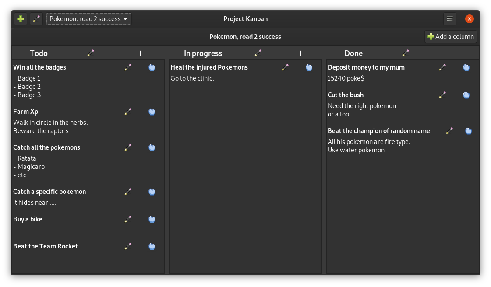
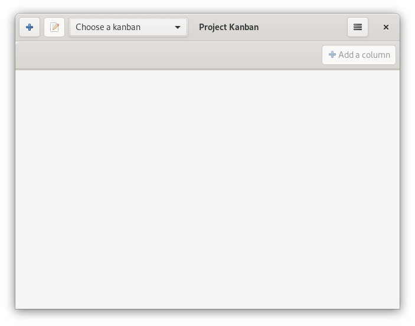

# Project Kanban (I'm not maintaining it anymore).
---

## What does this project do?

This project is a lightweight user-friendly desktop software to create and manage basic [kanbans boards](#https://en.wikipedia.org/wiki/Kanban) for your personal use.

- Create your kanban in one click.
- Create your columns.
- Create your cards.
- Drag and drop your cards from one column to another.
- Auto save on your computer.
- No account.
- self-sufficient (It only needs GTK, no internet or other softwares needed).

## Preview
*The theme depends of your desktop theme.*

## Why is this project useful?

I personally got disappointed by kanban softwares. You either had to pay for it or have to sign dark contracts and hope your information would stay yours...

Otherwise, open source softwares were fine but far too heavy for my humble use. I needed something simple and yet efficient to track my work (without mandatory Agile methodology). Then, I found [My Personal Kanban](#https://github.com/greggigon/my-personal-kanban). It was perfectly what I needed. Until I cleared my web browser cache and lost all my kanbans... (You can export your kanban into a file but doing it every time you edit a card is annoying).

That's why I'm making this project.

## How to install and run it *[Flatpak Release*]

### Installation

1. Make sure Flatpak is installed on your computer
    - [How to install Flatpak](https://flatpak.org/setup/)
2. Download the last [release](https://github.com/Lyaaaaaaaaaaaaaaa/Project_Kanban/releases) of Project Kanban.
3. Unzip the release.
4. Open a terminal in the folder and install it with Flatpak:

  `flatpak install io.github.lyaaaaaaaaaaaaaaa.Project_Kanban.flatpak`.
  
### Starting the software

- You can now use your application finder to launch the software. Just search for
Project Kanban.
- Or you can run the following command in a terminal:

  `flatpak run io.github.lyaaaaaaaaaaaaaaa.Project_Kanban`.

### Uninstalling

1. Run the following command in a terminal

  `flatpak remove io.github.lyaaaaaaaaaaaaaaa.Project_Kanban`

## How to install and run it *[Script Release]*

### Installation

1. Download the last [release](https://github.com/Lyaaaaaaaaaaaaaaa/Project_Kanban/releases).
2. Unzip the release. 
3. Give executable permission to the install.sh file
 
  `chmod +x install.sh `.

4. Run install.sh

  `./install.sh`.

### Starting the software

1. Give executable permission to the start.sh file

  `chmod +x start.sh`.

2. Run the start.sh script

  `./start.sh`.

## Building the Flatpak release from source

1. Download the [Flatpak branch](https://github.com/Lyaaaaaaaaaaaaaaa/Project_Kanban/tree/Flatpak)
2. Open a terminal inside the downloaded folder
3. Give execute permission to build_application.sh `chmod +x build_application.sh`
4. Run build_application.sh `./build_application.sh`
5. The bundled application will be inside the .bundle folder.

## More information:

[Code of conduct](https://github.com/Lyaaaaaaaaaaaaaaa/Project_Kanban/blob/master/CODE_OF_CONDUCT.md)

[How to contribute](https://github.com/Lyaaaaaaaaaaaaaaa/Project_Kanban/blob/master/CONTRIBUTING.md)

