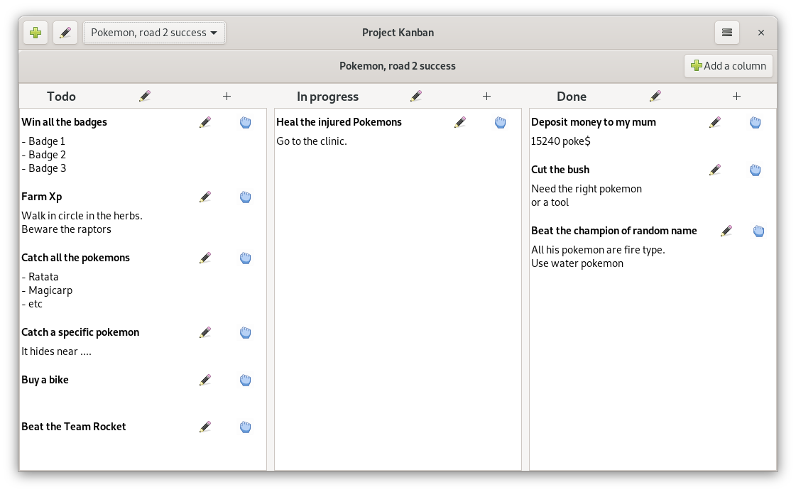

# Project Kanban

## Features

- Create your Kanban.
- Create your columns.
- Create your cards.
- Drag and drop your cards from one column to another.
- Auto save on your computer.
- No account.
- Self-sufficient (It only needs GTK, no internet or other softwares needed).

## Preview
*The theme may changes depending of your desktop theme.*

### Dark

### Light

## Why use Project Kanban and not another application?
Here are reasons to use this software:

**You**
1. Don't want an unnecessarily complicated and heavy application.
2. You don't like mandatory Agile methodology
3. You want a desktop application and not a server architecture or web app
4. You don't like accepting '*Use policy*'
5. You work on personnal project and don't need to share it with a team
6. You like the auto saving applications :).

## [Download](https://github.com/Lyaaaaaaaaaaaaaaa/Project_Kanban/releases)

Need help with the installation? Check this 
[link](https://github.com/Lyaaaaaaaaaaaaaaa/Project_Kanban#how-to-install-and-run-it-flatpak-release)

---

## Contact and support 

### Contact
You can get in touch with me on Discord.
You just have to join my [server](https://discord.gg/hSey9Bv)

### Support
Read the [How to contribute](https://github.com/Lyaaaaaaaaaaaaaaa/Project_Kanban/blob/master/CONTRIBUTING.md)
if you need to report errors, ask suggestions or help this project.
